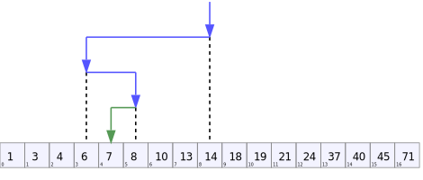

# algo-quickstarts
Algorithm quickstarts

## Resources
### People
- [scandum | GitHub](https://github.com/scandum)
### Books
- [Grokking Algorithms: An illustrated guide for programmers and other curious people | Manning](https://www.amazon.ca/Grokking-Algorithms-illustrated-programmers-curious/dp/1617292230/)
- [Classic Computer Science Problems in Python | Manning](https://www.amazon.ca/Classic-Computer-Science-Problems-Python/dp/1617295981/)
### Videos
- [Dynamic Programming - Learn to Solve Algorithmic Problems & Coding Challenges | Youtube](https://www.youtube.com/watch?v=oBt53YbR9Kk)
- [Algorithms and Data Structures Tutorial - Full Course for Beginners | YouTube](https://www.youtube.com/watch?v=8hly31xKli0)
